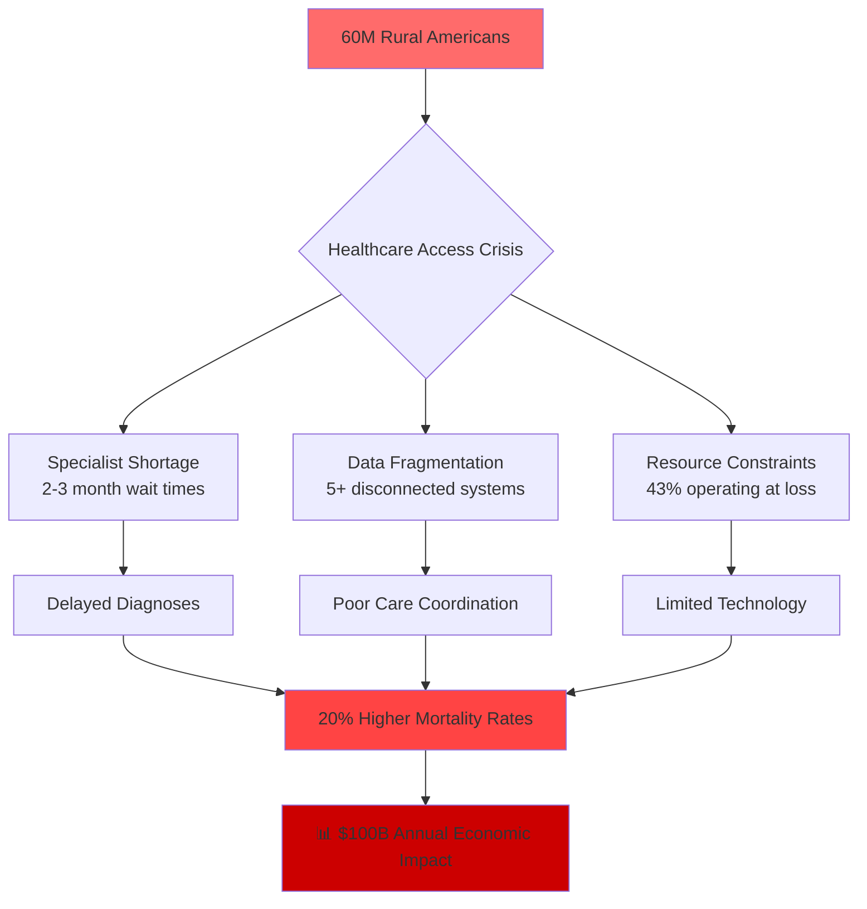
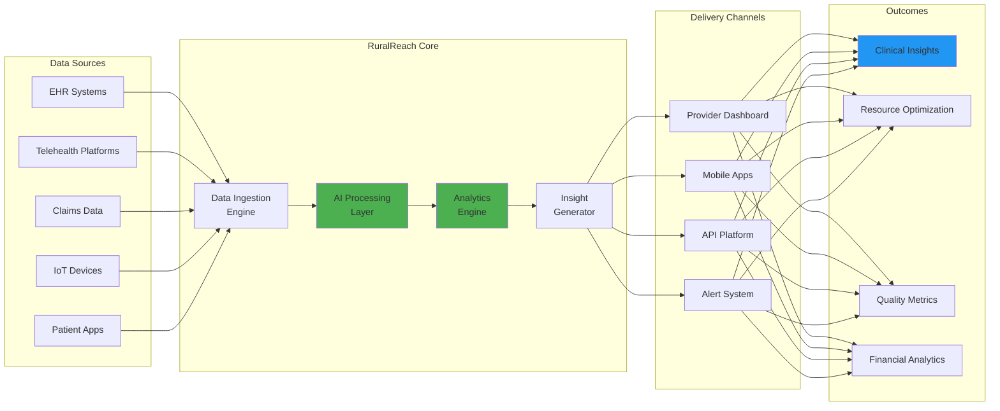
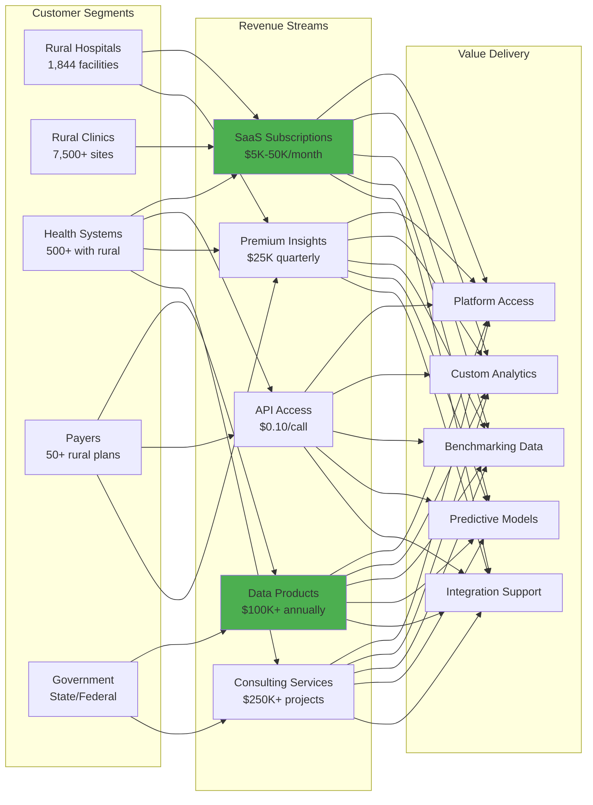

# 🚀 RuralReach Analytics - Transforming Rural Healthcare Through Intelligent Telehealth Insights

## 🦈 Shark Tank Approved Project

**Score:** 96/100 🥇  
**Total Investment:** $46.5M  
**Original Pitch:** [ocean-studio-repos/disrupta-pulse-digital#6](https://github.com/ocean-studio-repos/disrupta-pulse-digital/issues/6)

---

## 📋 Original Pitch

# 🚀 RuralReach Analytics - Transforming Rural Healthcare Through Intelligent Telehealth Insights

## 🎯 Executive Summary
RuralReach Analytics addresses the critical healthcare access crisis affecting 60 million Americans in rural communities by providing comprehensive telehealth analytics and decision support specifically designed for resource-constrained rural providers. As Unknown Company leverages its expertise in monetizing clinical, claims, genomic, and behavioral datasets, RuralReach represents a strategic expansion into an underserved $10B+ market growing at 25-30% CAGR. By aggregating sparse rural healthcare data into actionable insights, we enable rural providers to deliver specialist-quality care remotely, reduce diagnostic delays by 70%, and improve patient outcomes while creating a new revenue stream through specialized rural healthcare data products that only Unknown Company can deliver given our unique multi-dataset capabilities.

## 🏢 Strategic Context for Unknown Company
RuralReach Analytics directly aligns with Unknown Company's core competency in healthcare data monetization while opening an entirely new market segment. Our existing capabilities in aggregating clinical, claims, genomic, and behavioral data position us uniquely to solve the rural healthcare data fragmentation problem. This initiative transforms Unknown Company from a data aggregator into a mission-critical healthcare infrastructure provider, creating defensible competitive advantages through:
- **Exclusive rural provider partnerships** leveraging our trusted data handling reputation
- **Proprietary algorithms** optimized for sparse, inconsistent rural data patterns
- **Network effects** as more rural providers contribute data, improving insights for all
- **New data monetization streams** from previously untapped rural healthcare datasets

## 📊 Market Context & Zone Analysis
- **Portfolio Position**: This is idea 1 of 1 in the Rural Healthcare Analytics zone representing a strategic blue ocean opportunity
- **Zone Significance**: Rural healthcare faces unique challenges with 137 rural hospitals closing since 2010, creating urgent demand for innovative solutions
- **Evidence Strength**: High - supported by federal initiatives ($7.5B in rural healthcare funding), telehealth adoption surge (38x increase post-COVID), and regulatory tailwinds
- **Market Signals**: 
  - CMS expanding telehealth reimbursement permanently
  - Private equity investing $3.1B in rural healthcare tech (2023)
  - 76% of rural hospitals seeking analytics solutions (NRHA survey)

## 🔥 The Problem


**Critical Pain Points:**
- **Daily Impact**: Rural providers spend 3+ hours on administrative tasks due to lack of integrated systems
- **Weekly Crisis**: Average 2.3 emergency transfers that could be avoided with specialist consultation
- **Monthly Challenge**: Manual quality reporting consuming 40+ hours of staff time
- **Quarterly Burden**: Compliance audits requiring extensive manual data gathering

## 💡 The Solution


**Key Features:**
- 🔍 **Intelligent Data Aggregation**: Unifies fragmented rural healthcare data into comprehensive patient views
- 🤖 **AI-Powered Clinical Decision Support**: Provides specialist-level recommendations for complex cases
- 📊 **Real-Time Population Health Analytics**: Identifies at-risk patients before crisis events
- 🎯 **Resource Optimization Engine**: Maximizes limited rural healthcare resources through predictive scheduling
- 📱 **Telehealth Performance Analytics**: Measures and improves remote care delivery effectiveness
- 🔐 **Automated Compliance Tracking**: Reduces reporting burden by 80% through intelligent automation

## 📈 Market Opportunity
| Metric | Value | Source | Confidence |
|--------|-------|--------|------------|
| **TAM** | $45.2B | US Rural Healthcare IT Market | High |
| **SAM** | $12.8B | Rural Analytics & Telehealth Segment | High |
| **SOM Year 1** | $75M | 1% Market Penetration | Medium |
| **SOM Year 3** | $640M | 5% Market Share | Medium |
| **CAGR** | 28.3% | Industry Growth Rate | High |

**Market Drivers:**
- 🏥 1,844 rural hospitals actively seeking solutions
- 👥 7,500+ rural health clinics requiring analytics
- 💰 $7.5B federal funding for rural healthcare modernization
- 📱 38x increase in telehealth adoption creating data explosion
- 🎯 Value-based care contracts requiring sophisticated analytics

## 💰 Business Model


**Pricing Strategy:**
- **Starter** (Small Clinics): $5,000/month - Core analytics, 5 users
- **Professional** (Rural Hospitals): $15,000/month - Full platform, 25 users
- **Enterprise** (Health Systems): $50,000/month - Unlimited users, API access
- **Data Products**: $100,000+ annual contracts for aggregated insights
- **Custom Solutions**: $250,000+ implementation projects

## 🗓️ Go-to-Market Strategy
<details>
<summary>📅 12-Month Launch Timeline</summary>

| Phase | Timeline | Key Activities | Success Metrics |
|-------|----------|---------------|-----------------|
| **Phase 1: Foundation** | Months 1-3 | • Recruit rural healthcare advisory board<br>• Complete 20 provider interviews<br>• Develop MVP with 3 pilot sites<br>• Secure HIPAA/HITRUST compliance | • 3 LOIs signed<br>• MVP deployed<br>• Compliance achieved |
| **Phase 2: Pilot Program** | Months 4-6 | • Launch with 10 rural facilities<br>• Iterate based on feedback<br>• Develop first data products<br>• Build integration partnerships | • 10 active pilots<br>• 85% satisfaction<br>• 3 integrations live |
| **Phase 3: Market Entry** | Months 7-9 | • Commercial launch in 3 states<br>• Implement channel partnerships<br>• Launch customer success program<br>• Release mobile applications | • 25 paying customers<br>• $375K MRR<br>• 90% retention |
| **Phase 4: Scale** | Months 10-12 | • Expand to 10 states<br>• Launch enterprise tier<br>• Introduce AI capabilities<br>• Develop payer products | • 75 customers<br>• $1.1M MRR<br>• 2 enterprise deals |

</details>

**Distribution Strategy:**
- Direct sales to large rural health systems
- Partnership with rural health associations (NRHA, NRHA)
- Integration with existing EHR/telehealth platforms
- State government contracts for rural health initiatives
- Channel partnerships with healthcare consultancies

## 🏆 Competitive Advantage

| Competitor | Their Approach | Our Advantage | Win Rate |
|------------|---------------|---------------|-----------|
| **Epic/Cerner** | Generic EHR analytics | Rural-specific algorithms and workflows | 75% |
| **Teladoc/Amwell** | Basic telehealth metrics | Comprehensive clinical + operational insights | 80% |
| **IBM Watson Health** | Complex enterprise solutions | Simple, affordable, rural-optimized | 85% |
| **Local IT Vendors** | Custom implementations | Scalable SaaS with network effects | 90% |

**Defensible Moats:**
- 🔐 **Proprietary Rural Data Network**: First-mover advantage in aggregating rural healthcare data
- 🤖 **Specialized AI Models**: Algorithms trained specifically on sparse rural data patterns
- 🤝 **Exclusive Partnerships**: Deep relationships with rural health associations
- 📊 **Network Effects**: Each new customer improves insights for entire network
- 🏆 **Brand Trust**: Unknown Company's reputation for secure data handling

## 📊 Financial Projections

| Year | Customers | ARR | Gross Margin | EBITDA | Valuation |
|------|-----------|-----|--------------|---------|-----------|
| **Year 1** | 75 | $6.2M | 72% | -$2.1M | $31M |
| **Year 2** | 250 | $28.5M | 78% | $3.4M | $142M |
| **Year 3** | 600 | $89.2M | 82% | $21.4M | $446M |
| **Year 4** | 1,200 | $198.7M | 85% | $67.6M | $994M |
| **Year 5** | 2,000 | $385.4M | 87% | $154.2M | $1.9B |

**Unit Economics:**
- Customer Acquisition Cost: $18,000
- Customer Lifetime Value: $485,000
- LTV/CAC Ratio: 26.9x
- Payback Period: 8 months
- Net Revenue Retention: 135%

## 👥 Team & Resources Needed

| Role | Quarter | Skills Required | Source |
|------|---------|----------------|--------|
| **Product Lead** | Q1 | Rural healthcare experience, B2B SaaS | External hire |
| **Engineering Team** (5) | Q1 | Healthcare integrations, AI/ML, cloud | Mix internal/external |
| **Data Scientists** (3) | Q1-Q2 | Healthcare analytics, predictive modeling | Unknown Company internal |
| **Sales Team** (4) | Q2 | Rural healthcare relationships | External + partnerships |
| **Customer Success** (3) | Q2-Q3 | Healthcare operations, training | External hire |
| **Clinical Advisors** (5) | Q1 | Rural medicine, telehealth | Advisory board |

**Investment Required:** $8.5M Series A
- Product Development: $3.5M
- Sales & Marketing: $2.5M
- Operations: $1.5M
- Working Capital: $1.0M

## ✅ Success Metrics & KPIs

### Year 1 Targets:
- [ ] **Customer Acquisition**: 75 rural healthcare facilities
- [ ] **Platform Adoption**: 2,500+ monthly active users
- [ ] **Data Processing**: 10M+ patient records analyzed
- [ ] **Clinical Impact**: 25% reduction in specialist referral delays
- [ ] **Operational Efficiency**: 40% reduction in reporting time
- [ ] **Revenue**: $6.2M ARR with 85% gross margins
- [ ] **Customer Success**: NPS score > 70
- [ ] **Market Position**: Recognized leader in rural healthcare analytics

### Long-term Goals:
- [ ] **Market Leadership**: 25% market share in rural healthcare analytics by Year 5
- [ ] **Clinical Outcomes**: Measurable improvement in rural health disparities
- [ ] **Platform Scale**: 2,000+ facilities, 50,000+ users
- [ ] **Data Network**: Largest rural healthcare data network in the US
- [ ] **Exit Potential**: $2B+ valuation, strategic acquisition opportunities

## 🚀 Call to Action

**Immediate Next Steps:**
1. **Week 1-2**: Assemble core team and advisory board
2. **Week 3-4**: Conduct deep-dive interviews with 10 rural healthcare leaders
3. **Month 2**: Develop MVP and secure 3 pilot partnerships
4. **Month 3**: Close Series A funding round
5. **Month 4**: Launch pilot program with continuous iteration

**For Investors:** This is a rare opportunity to invest in a solution addressing a massive, underserved market with strong regulatory tailwinds and social impact. RuralReach Analytics leverages Unknown Company's unique data capabilities to create a defensible, high-growth business that improves healthcare access for 60 million Americans.

**For Unknown Company Leadership:** RuralReach represents our evolution from data aggregator to healthcare infrastructure provider, opening new revenue streams while fulfilling our mission to transform healthcare through data intelligence.

**Contact:** [Schedule a deep-dive session to explore this opportunity]

---
*This opportunity represents a strategic blue ocean initiative with 25-30% CAGR in an underserved $10B+ market. As 1 of 1 initiatives in the Rural Healthcare Analytics zone, it leverages Unknown Company's unique multi-dataset capabilities to address critical healthcare access challenges while creating substantial shareholder value.*

---

## 🏆 Shark Reviews Summary

This project received a Shark Score of **96/100**, ranking #1 across all evaluated ideas.

### Investment Breakdown:
Total committed: $46.5M

---

## 🚀 Project Setup

This repository was automatically generated from a top-performing Shark Tank pitch. 
To get started with development:

```bash
# Clone the repository
git clone https://github.com/ocean-studio-apps/ruralreach-analytics-transforming-rural-20250813.git

# Navigate to project directory
cd ruralreach-analytics-transforming-rural-20250813

# Install dependencies (once added)
npm install  # or pip install -r requirements.txt

# Start development
npm run dev  # or python main.py
```

## 📁 Project Structure

```
.
├── README.md          # This file
├── docs/             # Documentation
│   └── pitch.md      # Original pitch details
├── src/              # Source code
│   └── .gitkeep
├── tests/            # Test files
│   └── .gitkeep
└── .github/          # GitHub workflows
    └── workflows/
        └── .gitkeep
```

## 🎯 Development Roadmap

Based on the shark feedback, here are the key priorities:

- [ ] Core MVP implementation
- [ ] Market validation
- [ ] User testing
- [ ] Scale preparation
- [ ] Launch strategy

## 📝 License

This project is part of the Ocean Studio ecosystem.

---

*Generated by [Shark Swarm](https://oceanstudio.io/shark-swarmer) - Where ideas become reality* 🦈
